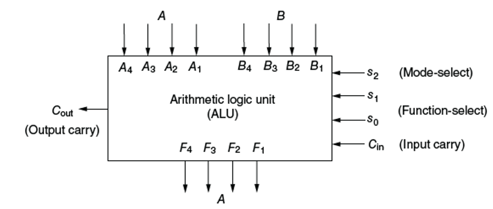
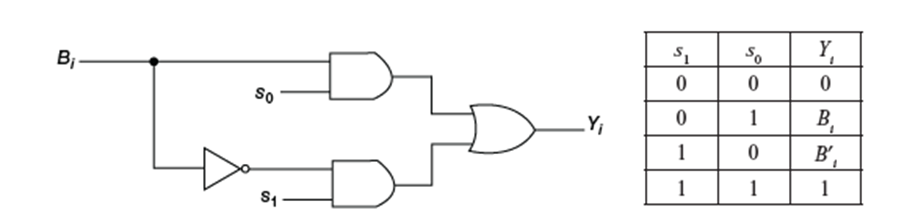
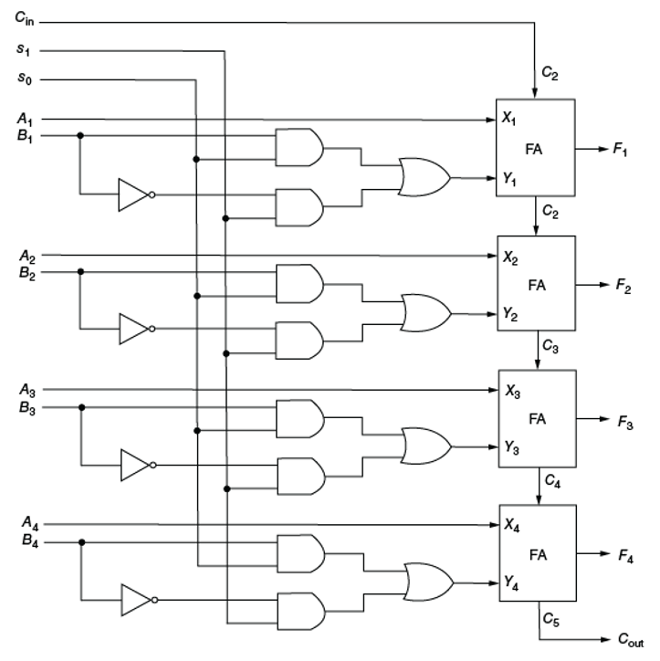
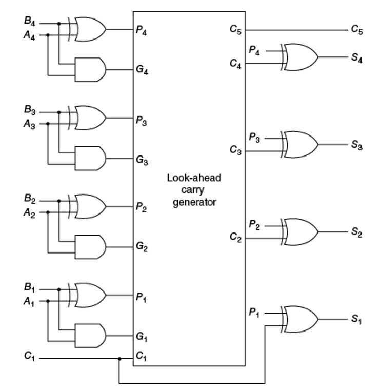

# CSE 4224 Digital System Design Laboratory  
## Institution: KUET  

## Lab 01: Half Adder, Full Adder, and Parallel Adder

**Date**: October 23, 2024

## Overview
In this lab, we learned how to design basic digital arithmetic circuits in Verilog, including a half adder, a full adder, and a parallel adder. These components are essential building blocks in digital systems, particularly for binary arithmetic operations.

### What We Covered
1. **Half Adder**: A simple 1-bit adder that adds two single-bit binary numbers and produces a sum and carry-out.
2. **Full Adder**: A 1-bit adder that adds three single-bit binary numbers (two inputs plus carry-in) and produces a sum and carry-out.
3. **Parallel Adder**: Combines multiple full adders to add multi-bit binary numbers in parallel.

## Basics of Verilog

Verilog is a hardware description language (HDL) used to model digital systems. It allows designers to describe a digital circuit at various levels of abstraction, from the behavioral level down to the gate level.

- **Module Definition**: In Verilog, every design is represented as a module, which encapsulates inputs, outputs, and internal functionality.
- **Data Types**: Verilog includes data types like `wire` (used to connect different parts of the circuit) and `reg` (for storing values).
- **Operators**: Verilog uses bitwise and logical operators for operations on binary values.
- **Time Scale**: The directive `timescale` specifies time units and precision for simulation (`10ps / 1ps` in this example).

## Lab Code

## Half Adder Design

<div align="center">
    
    <p><em>Figure 1: Half Adder</em></p>
</div>

The half_adder module is the basic component for adding two single-bit binary numbers.

```verilog
`timescale 10ps / 1ps
module half_adder (a, b, sum, carry);
	
    input a, b;
    output sum, carry;

    assign sum = a ^ b;
    assign carry = a & b;

endmodule
```

## Full Adder Design

<div align="center">
    
</div>
<div align="center">
    
    <p><em>Figure 2: Full Adder</em></p>
</div>

The Full_Adder module takes three inputs: two binary numbers and a carry-in, producing a sum and a carry-out.


```verilog
`timescale 10ps / 1ps

module Full_Adder (x, y, cin, s2, cout); 
	
    input x, y, cin;
    output s2, cout; 
    wire s1, cout1, cout2;

    // Internal half adders to calculate sum and carry
    half_adder h_a(x, y, s1, cout1);
    half_adder h_a2(s1, cin, s2, cout2);
    assign cout = cout1 | cout2;

endmodule
```
### Parallel Adder Design

<div align="center">
    
    <p><em>Figure 3: Parallel Adder</em></p>
</div>

The `Paraller_Adder` module connects multiple full adders to add four-bit binary numbers.

```verilog
`timescale 10ps / 1ps

module Paraller_Adder ();  
	
    reg a1, a2, a3, a4, b1, b2, b3, b4;
    wire s1, s2, s3, c1, c2, c3;
    wire s, c;

    // Connecting the half adder and full adders to form a parallel adder
    half_adder h_a(a1, b1, s1, c1);
    Full_Adder f_a(a2, b2, c1, s2, c2);
    Full_Adder f_a2(a3, b3, c2, s3, c3);
    Full_Adder f_a3(a4, b4, c3, s, c);

    initial begin
        a1 <= 1; a2 <= 0; a3 <=0; a4 <=1;
        b1 <= 0; b2 <= 0; b3 <=1; b4 <=1;
        #1 $display("c: = %b, s: %b,  s3: = %b, s2: = %b, s1: = %b\n", c, s, s3, s2, s1);
    end

endmodule
```

## Summary

In this lab, we designed and simulated a half adder, a full adder, and a four-bit parallel adder using Verilog. These designs were tested with various input combinations to verify correct behavior. The knowledge of Verilog and these basic arithmetic circuits lays the foundation for more complex digital designs.

Learn More about [Lab 01](Lab01/TEACHME.md)

---
---

## Lab 02: Digital System Design Lab Project: Arithmetic Logic Unit (ALU) Design
**Date**: November 05, 2024
## Overview
This project involves the design and simulation of an **Arithmetic Unit (AU)** as part of an Arithmetic Logic Unit (ALU) in Verilog. The design includes several components such as a Half Adder (HA), Lookahead Carry Generator (LACG), and control logic for bitwise processing. The ALU performs basic arithmetic operations without the logical (S2) functionalities.

<div align="center">
    
    <p><em>Figure 1: Arithmatic Logic Unit</em></p>
</div>


---

## Project Components

### 1. **Breadboard (BB.v)**
- Acts as the **top-level module** to simulate the system.
- Connects all submodules and initializes input signals for testing the circuit.
- Runs through all combinations of control signals (`s0`, `s1`) to validate functionality.


**Key Elements:**
- Registers for inputs `a`, `b`, and control signals  (`s0`, `s1`).
- Wires to carry outputs from submodules.
- Instantiates:
  - Four instances of the `BitProcessor` (formerly `circuit.v`) for bitwise operations.
  - A `Lookahead Carry Generator` (LACG) to handle arithmetic operations.

**Purpose:**

This module serves as the testbench and connects all the components: circuit modules and LACG (Look-Ahead Carry Generator). It simulates the inputs and shows how the outputs change.
Inputs:

**Inputs:**

- a[3:0]: 4-bit input vector used in the Look-Ahead Carry Generator.
- b[3:0]: Another 4-bit input vector used in the circuit module.
- s0, s1: Control signals that determine how the circuit module behaves.
- cin: Carry-in input to the Look-Ahead Carry Generator.

**Outputs:**

- y[3:0]: Output from the circuit modules. It is connected to the LACG for summing.
- f[3:0]: Output from the LACG. It represents the sum after the addition operation.
- carry: Carry-out from the LACG.

Explanation:**
- This module uses the circuit to create the individual bit outputs (y[0], y[1], y[2], y[3]) based on the b vector and the selection lines (s0, s1).
- These outputs (y) are then passed to the LACG module to calculate the sum and carry-out.
- The initial block defines various combinations of the input signals and simulates the process.


### 2. **Bit Processor (Circuit.v)**
- Handles individual bit operations based on control signals (`s0`, `s1`).
- Implements a simple selection mechanism:
  - `s0 = 0, s1 = 0`: Passes `~b`.
  - `s0 = 0, s1 = 1`: Passes `b`.
  - `s0 = 1, s1 = 0`: Sets output to 0.
  - `s0 = 1, s1 = 1`: Passes 1.

<div align="center">
    
    <p><em>Figure 3: Circuit</em></p>
</div>

**Purpose:**

This module represents a simple logic circuit used to control the bits of y based on the inputs s0, s1, and b. It works like a multiplexer based on the s0 and s1 selection lines.
Inputs:

- b: A single bit of the b input vector.
- s0 and s1: Control signals used to choose the logic for the output.

**Output:**

- y: The output of the logic circuit.

**Explanation:**

The circuit module implements the following logic:

- If s0 = 1 and s1 = 0, it outputs b. (addition)
- If s0 = 0 and s1 = 1, it outputs the complement of b. (subtraction)
- If s0 = 1 and s1 = 1, it outputs b.
- If s0 = 0 and s1 = 0, it outputs the complement of b.

### 3. **Lookahead Carry Generator (LACG.v)**
- Computes the sum of two 4-bit inputs `a` and `b` using a carry-lookahead mechanism.
- Ensures faster computation by precomputing carries.

**Components:**
- **Propagate (`p`)**: Determines if a carry is propagated to the next bit.
- **Generate (`g`)**: Determines if a carry is generated.
- **Sum (`sum`)**: Final 4-bit addition result.
- **Carry (`carry`)**: Final carry-out of the addition.

<div align="center">
    
    
    <p><em>Figure 3: Look Ahead Carry Generator</em></p>
</div>

**Purpose:**

The LACG module performs the carry look-ahead operation to speed up the calculation of carry during the addition process. It generates the carry signals efficiently and performs the final sum.
**Inputs:**

- a[3:0]: The first operand for the addition.
- y[3:0]: The second operand, derived from the circuit modules.
- cin: The initial carry-in for the addition.

**Outputs:**

- sum[3:0]: The sum of the addition, calculated by the LACG.
- carry: The final carry-out from the addition.

**Explanation:**

The LACG works by first calculating the propagate (p) and generate (g) signals for each bit using half adders (HA). The equations for the propagate (p) and generate (g) are:

### 4. **Half Adder (HA.v)**
- Basic building block to compute:
  - `Sum = a ⊕ b`
  - `Carry = a & b`

<div align="center">
    
    <p><em>Figure 1: Half Adder</em></p>
</div>


**Purpose:**

A half adder performs the basic addition of two bits and outputs the sum and carry.
**Inputs:**

-  a and b: Two bits to be added.

**Outputs:**

- sum: The sum of the two input bits.
- carry: The carry resulting from the addition.

**Explanation:**

The half adder is a fundamental circuit that adds two single-bit numbers:

- The sum is the XOR of the two bits: sum = a ^ b.
- The carry is the AND of the two bits: carry = a & b.

This module is used in the LACG to generate the p (propagate) and g (generate) signals for each bit during the carry look-ahead operation.

---

## Functional Workflow

### **Control Logic**
Control signals (`s0`, `s1`) determine the operation for each bit of the input `b`. These control bits drive the **BitProcessor** module, affecting the intermediate operations before summation.

### **Arithmetic Unit**
1. Individual bits of inputs `a` and `b` are processed by the `BitProcessor` module.
2. The `Lookahead Carry Generator` performs 4-bit addition using the outputs of the BitProcessor.
3. Outputs include:
   - Final sum (`f`).
   - Carry-out (`carry`).

---

## Simulation Results
The ALU was tested with multiple combinations of inputs and control signals, producing expected outputs as per the truth table of operations. The simulations validated:
- Bitwise control operations (`BitProcessor`).
- Efficient carry-lookahead addition (`LACG`).

---

## File Structure

├── BB.v # Top-level module connecting all components. 

```code
`timescale 10ps / 1ps
module BB();
    reg [3:0] a, b, f;
    wire [3:0] y;
    reg s0, s1, cin;

    circuit c1(b[0], s0, s1, y[0]);
    circuit c2(b[1], s0, s1, y[1]);
    circuit c3(b[2], s0, s1, y[2]);
    circuit c4(b[3], s0, s1, y[3]);

    LACG ll(a, y, cin, f, carry);

    initial begin
        a <= 4'b1011;
        b <= 4'b1001;

        s0 <= 0; s1 <= 0; cin <= 0; #1;
        s0 <= 0; s1 <= 1; cin <= 0; #1;
        s0 <= 1; s1 <= 0; cin <= 0; #1;
        s0 <= 1; s1 <= 1; cin <= 0; #1;
    end
endmodule

```
├── BitProcessor.v (formerly Circuit.v) # Processes individual bits. 

```code
`timescale 10ps / 1ps
module circuit(b, s0, s1, y);
    input b, s0, s1;
    output y;

    assign y = (s0 & b) | (s1 & ~b);
endmodule

```
├── LACG.v # Lookahead Carry Generator for fast addition. 

```code
`timescale 10ps / 1ps
module LACG(a, b, cin, sum, carry);
    input cin;
    input [3:0] a, b;
    wire [3:0] p, g;
    output [3:0] sum;
    output carry;
    wire [4:0] c;

    HA h1(a[0], b[0], p[0], g[0]);
    HA h2(a[1], b[1], p[1], g[1]);
    HA h3(a[2], b[2], p[2], g[2]);
    HA h4(a[3], b[3], p[3], g[3]);

    assign c[0] = cin;
    assign c[1] = g[0] | (p[0] & c[0]);
    assign c[2] = g[1] | (p[1] & c[1]);
    assign c[3] = g[2] | (p[2] & c[2]);
    assign c[4] = g[3] | (p[3] & c[3]);

    assign sum[0] = c[0] ^ p[0];
    assign sum[1] = c[1] ^ p[1];
    assign sum[2] = c[2] ^ p[2];
    assign sum[3] = c[3] ^ p[3];

    assign carry = c[4];
endmodule
```
To optimize the Lookahead Carry Generator (LACG) and reduce propagation delay, the carry computation can be directly implemented using predefined equations for each carry bit. Here's the updated LACG.v module with the direct carry computation:
```code
    // Direct computation of carries
    assign c[0] = cin; // Initial carry
    assign c[1] = g[0] | (p[0] & c[0]);
    assign c[2] = g[1] | (p[1] & g[0]) | (p[1] & p[0] & c[0]);
    assign c[3] = g[2] | (p[2] & g[1]) | (p[2] & p[1] & g[0]) | (p[2] & p[1] & p[0] & c[0]);
    assign c[4] = g[3] | (p[3] & g[2]) | (p[3] & p[2] & g[1]) | (p[3] & p[2] & p[1] & g[0]) | (p[3] & p[2] & p[1] & p[0] & c[0]);
```
├── HA.v # Half Adder for computing sum and carry. 
```code
`timescale 10ps / 1ps
module HA(a, b, carry, sum);
    input a, b;
    output carry, sum;

    assign sum = a ^ b;
    assign carry = a & b;
endmodule

```
## Future Enhancements

- Add logical operations (S2 functionality).
- Expand input size to support more bits (e.g., 8-bit, 16-bit).
- Implement a complete ALU with integrated logical operations.

---

## Conclusion
This project demonstrates the design of an Arithmetic Unit as part of an ALU using Verilog. By combining control logic, carry-lookahead addition, and bitwise operations, the design achieves efficient and modular arithmetic functionality.

